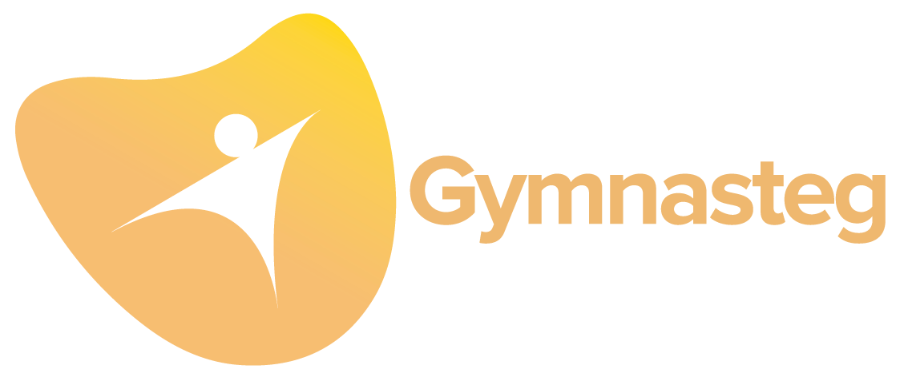

[](https://travis-ci.org/fga-eps-mds/2019.2-Gymnasteg-Frontend)

<a href="https://codeclimate.com/github/byronkamal/2019.2-Gymnasteg-Frontend/maintainability"></a>

[](http://isitmaintained.com/project/fga-eps-mds/2019.2-Gymnasteg-Frontend "Percentage of issues still open")


[](https://www.gnu.org/licenses/gpl-3.0)

[](https://codecov.io/gh/fga-eps-mds/2019.2-Gymnasteg-Frontend)

O projeto Gymnasteg surgiu como uma proposta de melhorar o processo de votação em campeonatos de ginastica de pequeno porte. O objetivo do projeto é fazer com o que usuário tenha uma boa experiencia no processo de votação e a efetividade na votação.


O repositório é mantido e gerenciado por alunos de Engenharia de Software da Universidade de Brasília campus Gama (UnB - FGA). Caso possua interesse, consulte as nossas [políticas de contribuição.](https://github.com/fga-eps-mds/2019.2-Gymnasteg-Wiki/blob/master/.github/contributing.md). Dúvidas ou sugestões devem ser encaminhadas ao gestores do projeto.
## Repositórios do projeto:
[Backtend](https://github.com/fga-eps-mds/2019.2-Gymnasteg-Backend.git)

[Wiki](https://github.com/fga-eps-mds/2019.2-Gymnasteg-Wiki)

## Pré Requisitos do Sistema

O Gymnasteg ultiliza a plataforma [Docker](https://www.docker.com/what-docker) para a configuração de ambiente, afim de evitar problemas de compatibilidade de sistema. Os passos abaixo podem ser seguidos para executar a aplicação usando a plataforma:

 1. Instalação do [Docker](https://docs.docker.com/engine/installation/)
 2. Instalação do [Docker Compose](https://docs.docker.com/compose/install/)
 3. Clone o repositório usando o comando:
 ```
 git clone https://github.com/fga-eps-mds/2019.2-Gymnasteg-Frontend.git
 ```
 4. Crie uma conexao local do docker na sua máquina para que o docker do front e backend possam se comunicar:
 ```
 docker network create network-api
 ```
 5. Crie e inicie os containers para o serviço:

 ```
 docker-compose up
 ```
 6. Acesse a aplicação na porta X do seu `browser`: [http://localhost:3000]()


### `npm test`

Launches the test runner in the interactive watch mode.<br>
See the section about [running tests](https://facebook.github.io/create-react-app/docs/running-tests) for more information.
